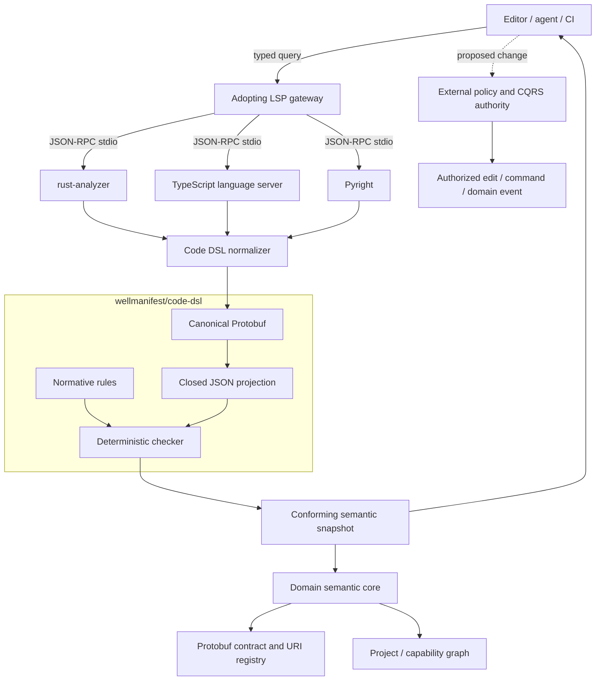
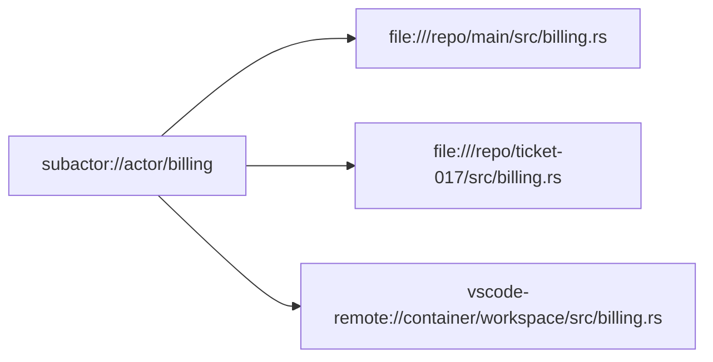
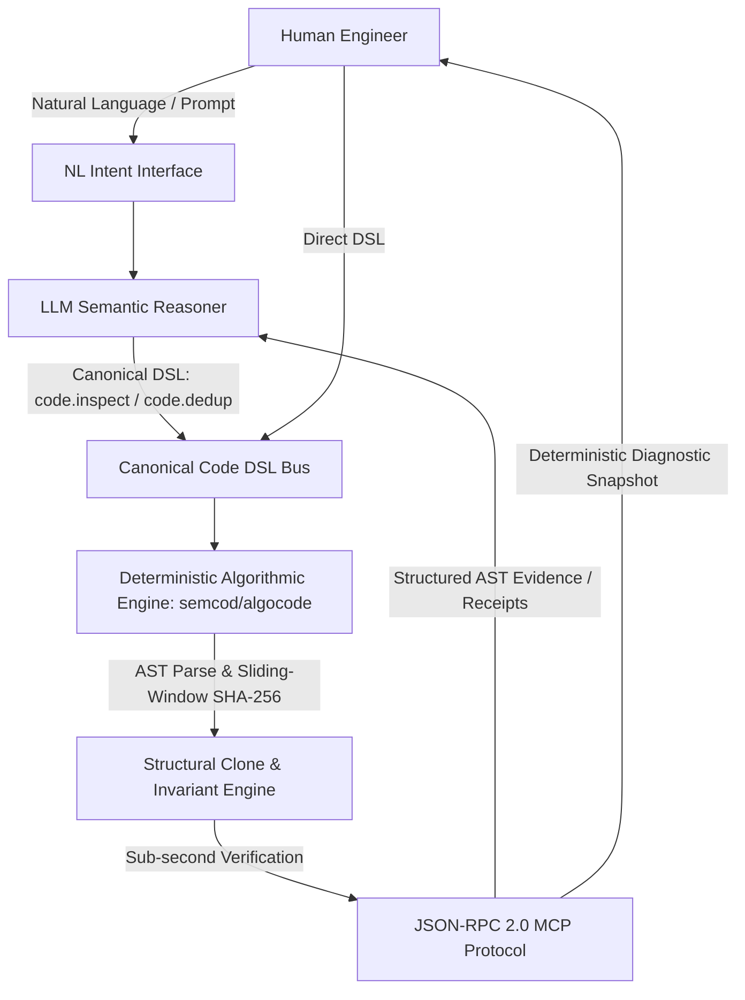

# Code DSL architecture

## Standard and runtime boundary

`wellmanifest/code-dsl` is a domain pack. The shaded conceptual boundary below
contains contracts and validation, not a hosted service.

The gateway owns process effects and MUST use an external allowlist. Code DSL
only describes its argv configuration and observations. A conforming snapshot
can inform an effect proposal but cannot authorize it.

## Identity versus location

The stable domain URI survives checkout movement. Each location remains bound
to its own workspace, Git/document state, and source range.

## Deployment responsibilities

| Component | Suggested technology | Home | Standard obligation |
| --- | --- | --- | --- |
| Gateway and process supervisor | Rust/Tokio | Adopting runtime organization | Direct argv, limits, isolation, health, LSP capability negotiation |
| Agent orchestration | Python or equivalent | Adopting product | LSP-first evidence sequence and propose-only model use |
| Editor client and dashboard | TypeScript | Adopting product | Typed Code DSL client and explicit freshness/error states |
| Code DSL contracts/checker | Protobuf, JSON Schema, Python stdlib | Wellmanifest | Versioned semantics and deterministic conformance |

The suggested technologies are non-normative. Conformance depends on observable
contract behavior, not a programming language or framework.

## Storage and cache

A cache key SHOULD bind workspace identity, operation, query operands, server
ID/version, configuration digest, workspace revision/dirty state, and relevant
document versions/digests. `observedAt` describes provenance but does not create
semantic identity.

SQLite, an embedded key-value store, or an in-memory cache MAY be used. The
store MUST preserve `partial`, `unavailable`, and `stale` explicitly and MUST
NOT promote them to complete/fresh during retrieval.

## Algorithmic Deterministic Engine & Tripartite Communication (semcod/algocode)

To enforce code quality without human fatigue or LLM hallucination, `wellmanifest/code-dsl` composes with the **Tripartite Communication Architecture** defined by [`wellmanifest/nl-dsl-llm`](https://github.com/wellmanifest/nl-dsl-llm) and implemented by [`semcod/algocode`](https://github.com/semcod/algocode):

### Tripartite Principles:
1. **Human**: Communicates intent in Natural Language (PL/EN) or direct Code DSL queries.
2. **LLM**: Operates strictly downstream of typed evidence or as a semantic translator into canonical DSL verbs (`code.inspect`, `code.dedup`, `conflict.check`). If grammar matches, execution bypasses the LLM entirely.
3. **Algorithm (`algocode`)**: Executes deterministic AST normalization, sliding-window block hashing, and path conflict checks in <0.5s. It emits invariant proofs and structured diagnostics back into the MCP/stdio stream.

