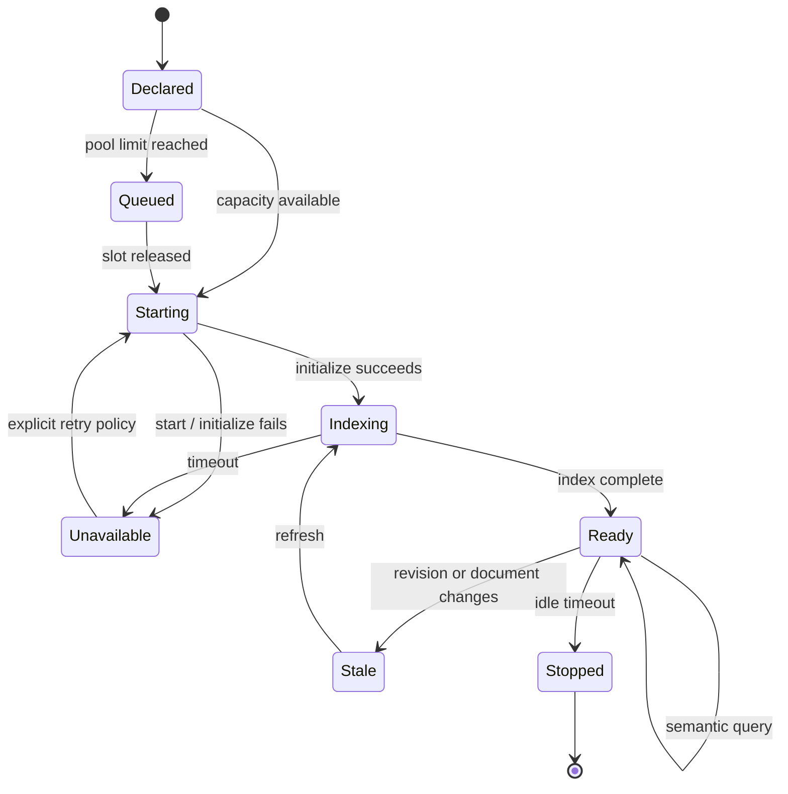
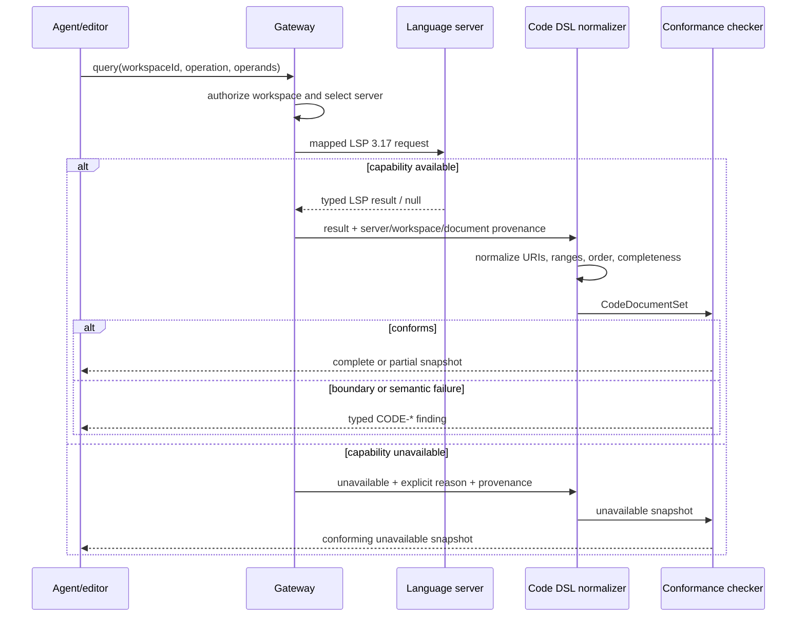
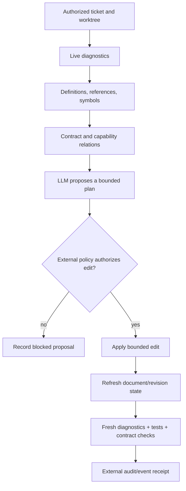

# Code DSL logic flow

## Workspace lifecycle

Pool limits count workspaces. `maxLanguagesPerWorkspace` separately bounds the
number of language-server processes configured for one workspace.

## Query normalization

Failure to obtain data is represented, not guessed. A legacy push diagnostic
may be normalized only when the gateway can correlate its document version and
the declared server/workspace provenance.

## LSP-first agent change flow

The LLM is downstream of typed evidence. The policy/CQRS boundary remains the
only path to effects, and fresh validation is required after source changes.
